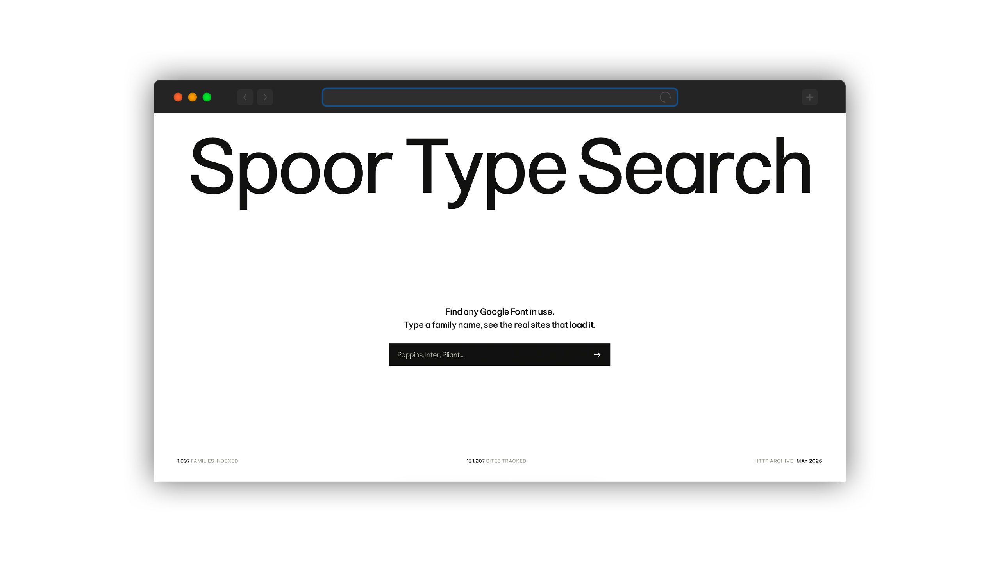
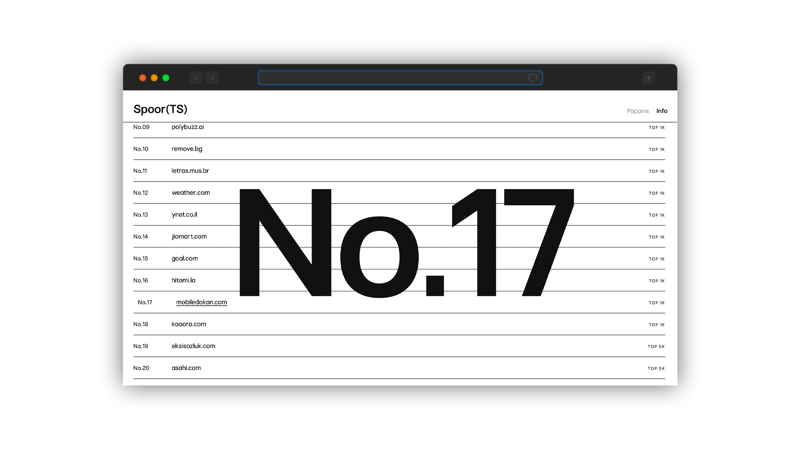

# SPOOR©

**Find where a Google Font lives on the web.**

SPOOR is a free search tool for the type community. Type the name of a Google Fonts family and get back a list of real websites that load that font in their code, ranked by popularity, each linking straight to the site.



It is a search engine, not a platform — no uploads, no accounts, no human curation. Just a box and a list of results.

---

## What it does

Type a Google Font (e.g. *Poppins*) and SPOOR returns the sites that actually **use** it — not sites that merely mention it by name, but sites that load the font in their CSS. Results are ordered by site popularity, most-visited first.



## What it is not

- **Not for fonts outside Google Fonts.** Self-hosted (commercial) foundries, Adobe Fonts, print: out of scope.
- **Not a text search.** It doesn't look for the font's name across the web (that was tried and dropped — too noisy). It detects real usage in site code.
- **Not a font identifier.** No image recognition.
- **Not a foundry or marketplace.** It doesn't sell or host fonts.

---

## How it works

One mechanism: **technical detection via HTTP Archive.**

1. **Monthly pre-compute (BigQuery).** A single query over the public [HTTP Archive](https://httparchive.org/) dataset extracts every Google Fonts request — `family → domain → rank` — deduplicated by root domain and capped to the top-100 most popular domains per family.
2. **Index in Cloudflare D1.** That result is loaded into a free SQLite database at the edge.
3. **Live search.** A serverless function queries D1 by family name and returns the domains, ordered by popularity. User searches never touch BigQuery.

## Honest limits

SPOOR shows a large sample, not a census:

- Only sites that HTTP Archive crawls (the CrUX list of sites with Chrome traffic). Smaller sites may not appear.
- Only each site's homepage (and some internal pages), not the whole site.
- Only Google Fonts. Self-hosted and Adobe are out of scope.
- A monthly snapshot, not real-time.

A font used inside an image, or loaded on a page that isn't crawled, is invisible here. SPOOR states this openly rather than pretending to be complete.

---

## Stack

- **Data:** HTTP Archive via Google BigQuery (public dataset).
- **Index:** Cloudflare D1.
- **Hosting + function:** Cloudflare Pages.

## Project structure

```
spoor/
├── index.html                  # the interface
├── README.md
├── REFRESH.md                  # how to update the index each month
├── home.jpg                    # screenshots (home + results)
├── results.jpg
└── functions/
    └── api/
        ├── search.js           # serverless search — queries D1
        └── stats.js            # index figures for the homepage footer
```

## Keeping it current

The index is a monthly snapshot and needs to be reloaded periodically. See **[REFRESH.md](REFRESH.md)** for the step-by-step refresh procedure.

---

## Typeface

SPOOR is set in **Pliant**, by [Non Foundry](https://fonts.google.com/specimen/Pliant) — a deliberate choice: the tool for tracking Google Fonts, dressed in the maker's own Google Font. The homepage title cycles live through Google Fonts as a demo of what the tool does.

## Credits

Designed and built by **Jona Saucedo** / **Non Foundry**, 2026.

---

*The name comes from the Dutch/Afrikaans word for the trail an animal leaves behind.*
